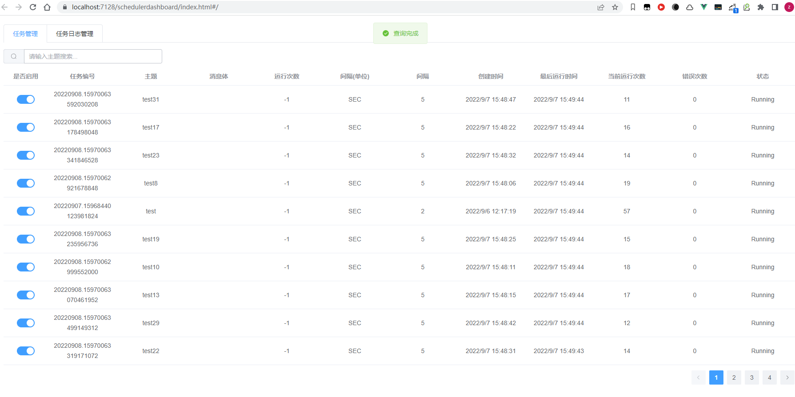
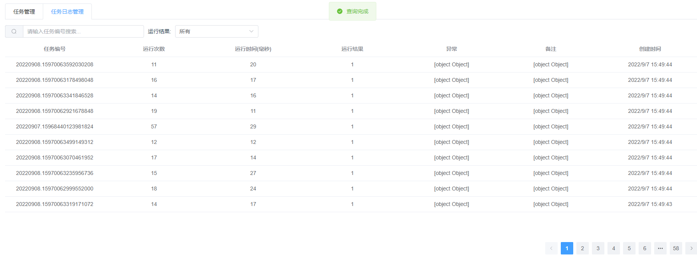

# FreeScheduler.Dashboard
Freescheduler监控面板

# 使用方式


```sh
Install-Package FreeScheduler.Dashboard # 安装nuget包
```

```c#
app.UseFreeSchedulerDashboard();


app.UseRouting().UseEndpoints(endpoints =>
{
    endpoints.MapControllers();
});
// 把下面这行换成上面的
// app.MapControllers();
```

打开`http://ip地址:端口号/schedulerdashboard/index.html`即可访问到监控面板

截图如下：




