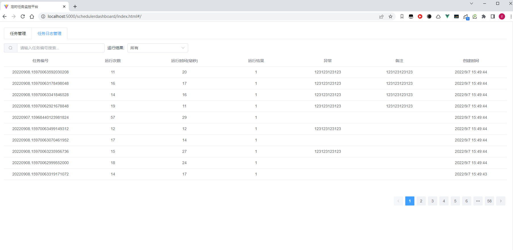

# FreeScheduler.Dashboard
Freescheduler自用的一个监控面板，简单用Vue3+TypeScript+Vite+ElementPlus写的，支持权限校验，官方地址：[FreeScheduler](https://github.com/2881099/FreeScheduler)

# 使用方式


```sh
Install-Package FreeScheduler.Dashboard # 安装nuget包
```

```c#
app.UseFreeSchedulerDashboard(it =>
{
    // it.DashboardAuthorizationFilter = null;// 自定义权限校验 不自定义的话默认本地地址才能访问
    // it.TaskTableName // 表名 默认FreeScheduler_task
    // it.TaskLogTableName // 日志表名 默认FreeScheduler_tasklog
});

// .NET 6 MinimalApi 必须加这一句重新匹配endpoint
app.UseRouting();

app.MapControllers();
```

打开`http://ip地址:端口号/schedulerdashboard/index.html`即可访问到监控面板

截图如下：




# 注意事项

1. 使用的.NET 6版本编译的，其它低版本目前需要自己修改代码集成
2. 使用http访问如果存在https重定向需自行修改跨域配置，使用https访问则无此问题
3. 权限访问方面，可自行继承`IDashboardAuthorizationFilter`接口，根据返回值来决定是否有权限访问页面
4. .NET 6 必须加`app.UseRouting()`这一句重新匹配Endpoint，因为在管道内部修改了请求的url，因此一进来匹配不到相应的Endpoint
